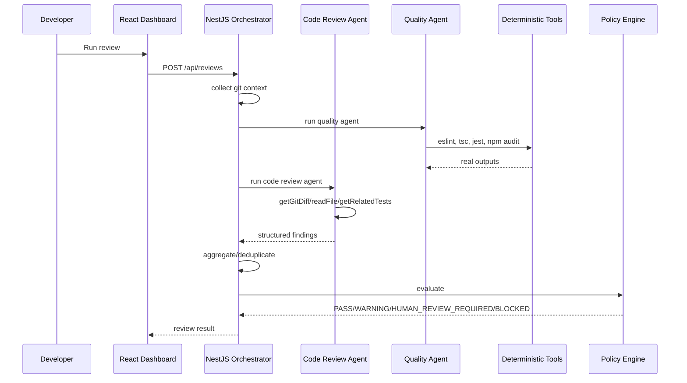
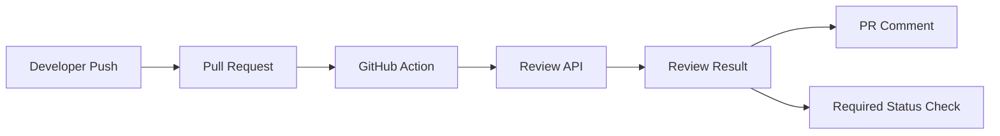

# Architecture

## System Context

The platform reviews a configured local repository and returns a policy decision with traceable evidence. The MVP avoids external storage and queues so it can be demonstrated live from one machine.

## Components

- `apps/api`: NestJS API, orchestration service, DTO validation, health and review endpoints.
- `apps/web`: React dashboard for review execution, summary, findings, quality checks, and trace.
- `packages/shared`: Zod schemas and TypeScript contracts.
- `packages/agents`: repository tools, Code Review Agent, Quality Agent, policy engine, aggregator, trace recorder.
- `sample-project`: intentionally imperfect NestJS business app.

## Code Review Agent

The Code Review Agent is not given shell access. It can use controlled repository tools:

- `getGitDiff`
- `readFile`
- `searchRepository`
- `getPackageInfo`
- `getRelatedTests`
- `getCodingStandards`

All file access is constrained to the configured repository root. AI output must match the shared finding schema. If Gemini is disabled or unavailable, the demo uses local evidence-based heuristics rather than fabricating a successful LLM result.

## Quality Agent

The Quality Agent runs deterministic tools through an allowlist:

- `npm run lint -- --format json`
- `npm run typecheck`
- `npm run test:coverage -- --json`
- `npm audit --json --audit-level=moderate`

Tool output is source of truth. A failed Jest test is reported as a failed Jest test; the LLM cannot override or invent deterministic status.

## Policy Engine

Policy separates deterministic gates from AI judgement:

- TypeScript/build failure: `BLOCKED`
- Unit-test failure: `BLOCKED`
- Critical/high deterministic security finding: `BLOCKED`
- Configured deterministic quality gate failure: `BLOCKED`
- AI critical/high: `HUMAN_REVIEW_REQUIRED`
- AI medium/low: `WARNING`
- Clean deterministic gates and no high-risk open AI findings: `PASS`

## Observability

Each review captures operational trace events:

- review start and completion
- agent start and completion
- repository tool usage
- deterministic tool usage
- aggregation
- policy evaluation

Trace events include timestamp, review id, agent, tool, duration where available, and status. Hidden model reasoning is not exposed.

## Failure Handling

The orchestrator distinguishes code quality failures from infrastructure failures. For example, Jest test failures become quality results, while a tool process timeout becomes an execution error result.

## Human In The Loop

Findings support `OPEN`, `ACCEPTED`, `DISMISSED`, and `RESOLVED`. The UI lets a reviewer accept or dismiss findings. The MVP does not modify source code automatically.

## Scaling Considerations

For enterprise scale:

- move in-memory reviews to persistent storage
- run quality jobs asynchronously
- add queue workers per repository/language
- cache package install and tool outputs
- summarize large diffs before model calls
- use repository-specific policy profiles
- integrate with CI/CD status checks

## CI/CD Integration

The intended production flow is:

