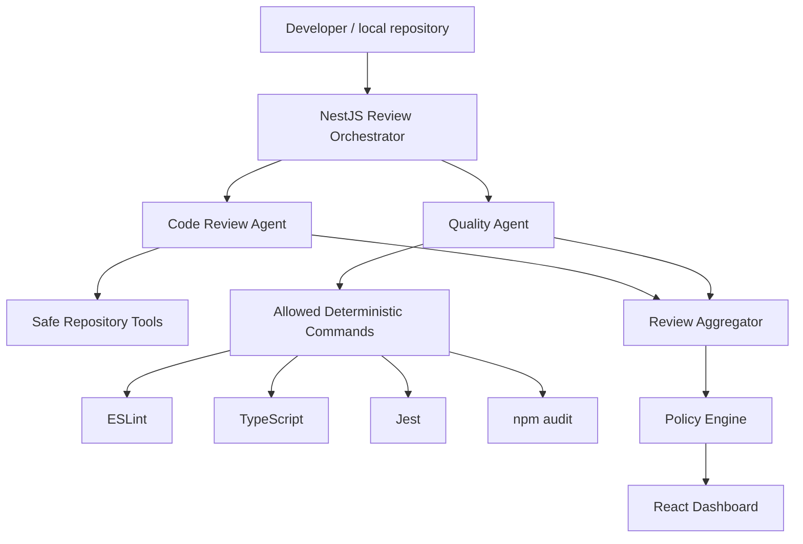

# Agentic AI Code Review & Quality Engineering Platform

Working NestJS + React demonstration of an agentic code review platform that combines AI review with deterministic quality checks.

## Problem Statement

Engineering teams need faster review feedback without pretending that an LLM can replace compilers, tests, security tooling, or human judgement. This prototype demonstrates a practical architecture where deterministic tools remain authoritative and AI contributes contextual reasoning.

## What It Does

- Runs an orchestrated review against `sample-project`.
- Executes deterministic tools: ESLint, TypeScript, Jest coverage, and `npm audit`.
- Runs a Code Review Agent with constrained repository tools and structured finding output.
- Aggregates findings, deduplicates them, and applies an explicit policy engine.
- Shows findings, quality checks, decisions, and operational agent trace in a polished React dashboard.
- Allows human actions on findings: open, accepted, dismissed, resolved.

## Architecture



## Technology Stack

- TypeScript monorepo with npm workspaces
- NestJS backend in `apps/api`
- React + Vite frontend in `apps/web`
- Shared Zod schemas in `packages/shared`
- Agent/tool layer in `packages/agents`
- Intentionally imperfect NestJS app in `sample-project`

## Why Two Agents

The Code Review Agent performs contextual source review using safe read/search/diff tools. The Quality Agent executes deterministic tools and never invents results. This separation keeps LLM reasoning useful without making it the source of truth for compiler, test, lint, or security status.

## Setup

```bash
npm install
cp .env.example .env
npm run build
npm run test
```

Set `GEMINI_API_KEY` and `ENABLE_LLM_REVIEW=true` to use Gemini. Without a key, the demo uses the local structured review fallback so the system remains runnable.

## Environment Variables

- `PORT`: API port, default `3001`
- `WEB_ORIGIN`: CORS origin, default `http://localhost:5173`
- `REPOSITORY_ROOT`: reviewed repo, default `./sample-project`
- `GEMINI_API_KEY`: optional Gemini API key
- `GEMINI_MODEL`: default `gemini-3.5-flash-lite`
- `ENABLE_LLM_REVIEW`: `true` to call Gemini, `false` for local fallback
- `MAX_REVIEW_FILES`: max changed files considered
- `MAX_FILE_BYTES`: max bytes read per file for AI context

## Running

```bash
npm run dev
```

Open:

- Web: `http://localhost:5173`
- API health: `http://localhost:3001/api/health`

Run a review from the UI with **Run Agentic Review**.

If port `3001` is already in use, stop the existing API process or start the backend with another port:

```bash
$env:PORT=3002
npm run dev:api
```

## Useful Commands

```bash
npm run build
npm run test
npm run lint
npm run demo:quality
npm --workspace sample-project run test:coverage
```

`sample-project` intentionally fails some checks. Platform tests should pass.

## Batch Review Workflow

The MVP review API processes one repository per request. A batch can be created safely
by iterating over approved repository paths and calling the same API for each repository.
This keeps repository validation, deterministic tooling, policy evaluation, and audit
traces identical for single and batch reviews.

Example PowerShell batch run against a locally running API:

```powershell
$repositories = @(
  "./sample-project",
  "C:/work/orders-service",
  "C:/work/catalog-service"
)

foreach ($repository in $repositories) {
  $payload = @{ repositoryPath = $repository } | ConvertTo-Json
  $result = Invoke-RestMethod `
    -Method Post `
    -Uri "http://localhost:3001/api/reviews" `
    -ContentType "application/json" `
    -Body $payload

  [pscustomobject]@{
    Repository = $result.repository
    ReviewId = $result.id
    Decision = $result.decision
    Findings = $result.findings.Count
  }
}
```

Only repositories allowed by the backend's configured workspace boundary can be
reviewed. For a larger deployment, this loop should become a queue worker with
concurrency limits, persistent review storage, retry/backoff, and per-repository
policy profiles. The current in-memory API is intentionally sized for a live demo.

## CI/CD Automation

The repository includes a GitHub Actions workflow at
`.github/workflows/ci.yml`. It validates the platform on pushes and pull requests:

1. Install dependencies with `npm ci`.
2. Build shared packages, agents, API, and web assets.
3. Run platform unit tests.
4. Run platform lint checks.
5. Run the sample project's deterministic quality command as an informational demo step.

The platform validation job is the release gate. The sample-project quality step is
allowed to report the intentional defects documented in
`sample-project/GROUND_TRUTH.md`; those defects demonstrate how the product surfaces
real failures and must not make the platform's own CI red.

Recommended enterprise pipeline stages:

```text
Pull request
    -> build and platform tests
    -> deterministic repository checks
    -> agentic review with bounded context
    -> aggregate findings and apply policy
    -> publish checks and human-review findings
    -> merge only after required gates pass
    -> deploy after environment approval
```

For CI integration, set `GEMINI_API_KEY` as an encrypted repository or organization
secret and keep `ENABLE_LLM_REVIEW=true` only in environments where source-code
processing is approved. If the model is unavailable, the backend uses its evidence-
based fallback; deterministic checks remain authoritative. A production integration
should add a webhook or queue endpoint, persistent review records, PR annotations,
timeouts, retry policy, and a concurrency budget before enabling reviews across many
repositories.

## Quality Check Model

Every deterministic check is normalized as:

```json
{
  "tool": "eslint",
  "status": "PASS | FAIL | WARNING | ERROR",
  "durationMs": 1420,
  "summary": "1 errors | 1 warnings",
  "metrics": {},
  "details": []
}
```

`FAIL` means the tool ran and found a code-quality problem. `ERROR` means the tool itself could not execute or did not produce parseable output. The policy engine treats deterministic failures and tool errors as blocking or incomplete verification, while AI high/critical findings route to human review.

Current sample-project quality expectations:

- TypeScript Build: `PASS`, `0 compilation errors`.
- ESLint: `FAIL`, currently `1 errors | 1 warnings`.
- Unit Tests: `FAIL`, currently `1 passed | 1 failed | 0 skipped`.
- Test Coverage: calculated from real Jest coverage output.
- Dependency/Security Audit: `FAIL` or `WARNING` based on live `npm audit` metadata.

## Security Controls

- Secrets only through environment variables.
- `.env` ignored by Git.
- Repository root validation prevents reviewing paths outside the workspace.
- Repository file access is read-only and path traversal protected.
- Quality tools use a fixed command allowlist.
- LLM access occurs only in the backend.
- AI output is Zod-validated before becoming findings.
- AI findings require human validation and do not automatically block releases.
- Operational trace events are shown without chain-of-thought.

## Demo Defects

See `sample-project/GROUND_TRUTH.md` for the intentional defects and expected detector.

## Limitations

- Review storage is in-memory.
- GitHub PR integration is documented as a future phase, not implemented.
- The offline fallback is heuristic; enable Gemini for stronger contextual review.
- The sample dependency audit reflects current installed package advisories and may change over time.
- The review endpoint is synchronous for demo simplicity; the UI shows workflow state during execution and then renders the backend trace once the review completes.

## Future Improvements

- Persist reviews and audit events in MongoDB or Postgres.
- GitHub Actions/webhook integration with PR comments.
- Organization-specific coding standards packs.
- Cost controls through diff summarization and model routing.
- Approved auto-fix workflow with human signoff.
- Multi-language tool runners.
