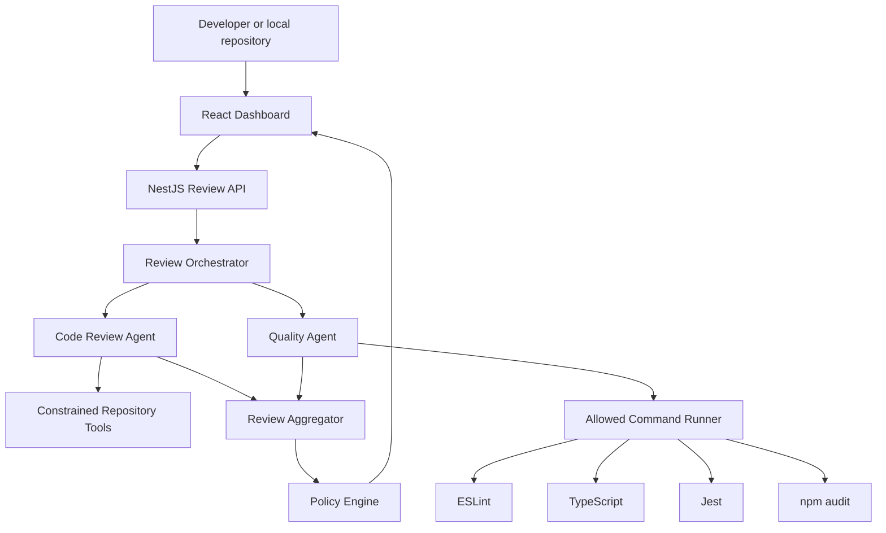
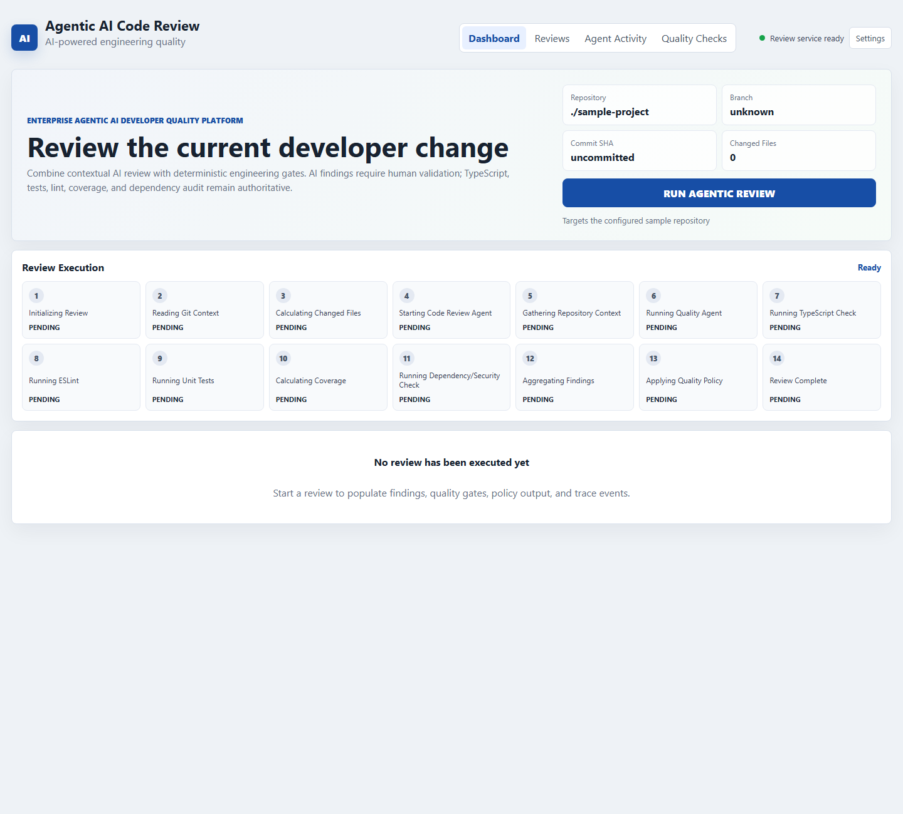
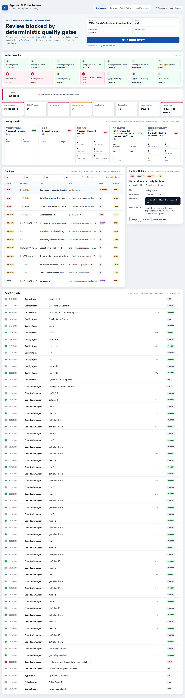
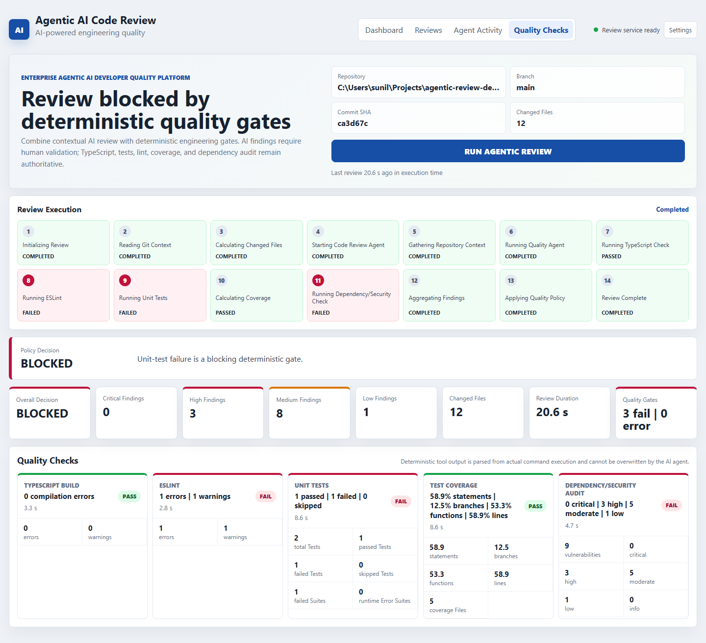
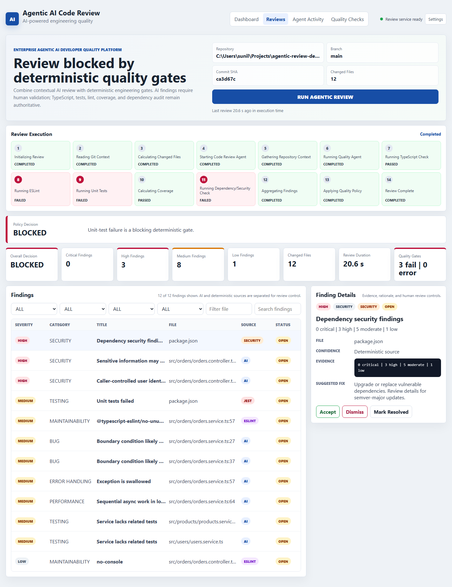
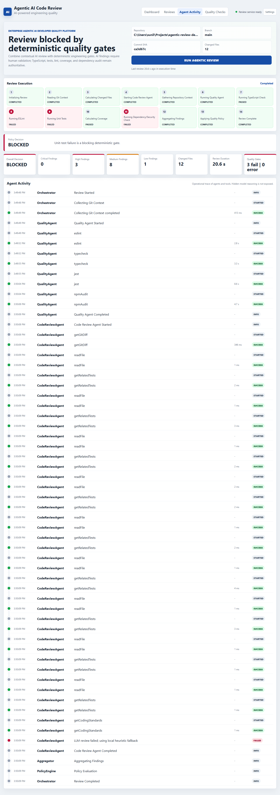

# Agentic AI Code Review and Quality Engineering Platform Project Documentation

## Document Purpose

This document describes the working demonstration project for the Agentic AI Code Review and Quality Engineering Platform. It is intended for technical architects, senior engineers, engineering leaders, and reviewers who need to understand what the project does, how it is built, how it is operated, and how it demonstrates agentic AI in a realistic developer quality workflow.

The project is a TypeScript monorepo with a NestJS backend, React frontend, shared schemas, agent packages, deterministic quality tooling, and an intentionally imperfect NestJS sample application. It demonstrates how AI review agents can collaborate with traditional engineering tools without replacing compilers, tests, linting, security checks, or human judgement.

## Executive Summary

The platform reviews a local repository or sample project through a controlled backend orchestrator. The orchestrator gathers Git context, runs a Code Review Agent, runs a Quality Agent, aggregates findings, applies a policy engine, and returns a structured review that is displayed in a React dashboard.

The main architectural principle is separation of authority:

- Deterministic tools such as TypeScript, ESLint, Jest, coverage, and npm audit are the source of truth for their results.
- AI produces contextual findings with evidence, confidence, file references, and suggested fixes.
- AI findings require human validation and do not automatically block production.
- Deterministic blocking gates can block the review when compilation, tests, security, or configured quality gates fail.

## Project Goals

- Demonstrate a hands-on NestJS, React, TypeScript, and Node.js product-engineering implementation.
- Show a practical agentic AI architecture with controlled repository tools.
- Perform intelligent code review using structured AI output.
- Execute real deterministic quality checks and normalize their output.
- Make the distinction between AI findings and deterministic tool findings visible.
- Provide traceability, operational observability, and human-in-the-loop review controls.
- Preserve security guardrails such as environment-only secrets, path validation, command allowlisting, and read-only AI repository access.

## Scope

### In Scope

- Local monorepo demonstration project.
- NestJS review orchestration API.
- React dashboard for reviews, findings, quality checks, and trace.
- Code Review Agent using constrained repository tools and Gemini or local fallback.
- Quality Agent running allowed deterministic commands.
- Explicit policy engine.
- Structured schemas using Zod.
- Sample NestJS business application with intentional defects.
- Tests for important platform components.
- Dockerfiles and docker-compose configuration.

### Out of Scope for Current MVP

- Persistent database-backed review history.
- GitHub webhook and pull-request comments.
- Automatic code modifications.
- Multi-repository scheduling.
- User authentication and authorization.
- Organization-wide policy administration UI.

## Repository Structure

```text
agentic-review-demo/
  apps/
    api/                         NestJS backend and review orchestrator
    web/                         React Vite dashboard
  packages/
    agents/                      Code Review Agent, Quality Agent, policy, trace, tools
    shared/                      Shared Zod schemas and TypeScript types
  sample-project/                Intentionally imperfect NestJS application
  docs/
    project-documentation/       This document, Word version, and screenshots
  scripts/                       Utility and screenshot capture scripts
  README.md                      Setup and usage
  ARCHITECTURE.md                Architecture details
  DEMO.md                        Demo script
  docker-compose.yml             Container orchestration
```

## Technology Stack

| Layer | Technology | Purpose |
|---|---|---|
| Frontend | React, TypeScript, Vite | Interactive engineering dashboard |
| Backend | NestJS, TypeScript, Node.js | Review orchestration and API layer |
| AI | Gemini API with local fallback | Contextual code review findings |
| Validation | Zod | Structured output and API model validation |
| Quality | ESLint, TypeScript compiler, Jest, npm audit | Deterministic quality and security checks |
| Storage | In-memory MVP storage | Simple demo review state |
| DevOps | Dockerfiles, docker-compose | Containerized local execution |
| Repository | Git | Branch, commit, diff, and changed-file context |

## System Context



## End to End Workflow

1. The user opens the React dashboard.
2. The dashboard shows the configured repository, branch, commit SHA, and changed files.
3. The user clicks Run Agentic Review.
4. The NestJS API creates a review ID and trace recorder.
5. Repository tools validate the root path and gather Git context.
6. The Quality Agent executes deterministic commands through an allowlist.
7. The Code Review Agent gathers controlled code context and produces structured findings.
8. The aggregator deduplicates AI and deterministic findings.
9. The policy engine evaluates deterministic gates and AI finding severity.
10. The dashboard displays the decision, findings, quality checks, and activity trace.
11. The user can accept, dismiss, or resolve findings.
12. Policy is recalculated after human actions.

## Running Project Screenshots

The following screenshots were captured from the running application and represent the current demo state.

### Dashboard Before Review



### Dashboard After Completed Review



### Quality Checks Panel



### Findings and Human Review



### Agent Activity Trace



## Backend API

| Endpoint | Method | Purpose |
|---|---:|---|
| `/api/health` | GET | Health check |
| `/api/reviews` | POST | Start a new review |
| `/api/reviews/:id` | GET | Get complete review result |
| `/api/reviews/:id/findings` | GET | Get review findings |
| `/api/reviews/:id/quality` | GET | Get deterministic quality results |
| `/api/reviews/:id/trace` | GET | Get operational trace events |
| `/api/reviews/:reviewId/findings/:findingId` | PATCH | Update finding status |

## Code Review Agent

The Code Review Agent performs contextual analysis over bounded repository evidence. It does not receive unrestricted repository access or a shell execution tool.

### Controlled Tools

- `getGitDiff()`
- `readFile(path)`
- `searchRepository(query)`
- `getPackageInfo()`
- `getRelatedTests(file)`
- `getCodingStandards()`
- `getQualityResults()`

### Responsibilities

- Identify security risks such as missing authorization.
- Detect missing input validation and weak DTOs.
- Identify business logic bugs.
- Review error handling, maintainability, architecture, testing gaps, and performance concerns.
- Provide evidence, file paths, suggested fixes, and confidence.
- Return structured findings that pass schema validation.

## Quality Agent

The Quality Agent runs deterministic tools and normalizes their outputs into a common model. It does not invent tool results and does not allow arbitrary shell commands.

### Command Allowlist

| Tool | Command | Result Type |
|---|---|---|
| ESLint | `npm run lint -- --format json` | Lint errors and warnings |
| TypeScript | `npm run typecheck` | Compilation status |
| Jest and Coverage | `npm run test:coverage -- --json` | Test results and coverage metrics |
| npm audit | `npm audit --json --audit-level=moderate` | Dependency vulnerabilities |

### Normalized Quality Check Model

```json
{
  "tool": "eslint",
  "status": "PASS | FAIL | WARNING | ERROR",
  "durationMs": 1420,
  "summary": "1 errors | 1 warnings",
  "metrics": {},
  "details": []
}
```

`FAIL` means the tool ran successfully and found a code or dependency problem. `ERROR` means the tool itself could not execute or did not produce parseable output.

## Current Demonstration Quality Results

| Check | Status | Current Result |
|---|---|---|
| TypeScript Build | PASS | 0 compilation errors |
| ESLint | FAIL | 1 error and 1 warning |
| Unit Tests | FAIL | 1 passed and 1 failed |
| Test Coverage | PASS | Real coverage values from Jest output |
| Dependency Security Audit | FAIL | 0 critical, 3 high, 5 moderate, 1 low |

## Policy Engine

The policy engine makes the release decision from normalized findings and quality checks.

| Condition | Decision |
|---|---|
| TypeScript failure | BLOCKED |
| Unit test failure | BLOCKED |
| Critical or high deterministic security finding | BLOCKED |
| Configured deterministic quality gate failure | BLOCKED |
| AI critical or high finding | HUMAN REVIEW REQUIRED |
| AI medium finding | WARNING |
| AI low finding | WARNING or advisory |
| Quality tool infrastructure error | BLOCKED or incomplete verification |
| All gates pass and no high-risk AI findings remain | PASS |

The LLM alone does not block production. AI findings require human validation.

## Human in the Loop Controls

Findings support the following statuses:

- OPEN
- ACCEPTED
- DISMISSED
- RESOLVED

The dashboard allows a reviewer to inspect evidence and suggested fixes, accept findings, dismiss findings, and mark findings resolved. Policy is recalculated after finding status changes.

## Observability and Traceability

The trace model captures operational events only. It does not expose hidden model reasoning.

Each trace event includes:

- Review ID
- Timestamp
- Agent
- Tool
- Event
- Duration
- Status
- Optional details

Example events include Review Started, Collecting Git Context, Quality Agent Started, eslint, typecheck, jest, npmAudit, Code Review Agent Started, readFile, getRelatedTests, Policy Evaluation, and Review Completed.

## Security Architecture

The project includes the following guardrails:

- API keys are read from environment variables.
- `.env` is ignored by Git.
- Repository root validation prevents traversal outside the workspace.
- Repository access for the Code Review Agent is read-only.
- File reads are path constrained.
- Quality command execution uses a strict allowlist.
- The LLM is not given arbitrary shell execution.
- Structured AI output is schema validated.
- Deterministic tool results remain authoritative.
- AI findings require human validation.
- Operational traces avoid chain-of-thought disclosure.

## Environment Variables

| Variable | Purpose | Example |
|---|---|---|
| `PORT` | API port | `3001` |
| `WEB_ORIGIN` | CORS origin | `http://localhost:5173` |
| `REPOSITORY_ROOT` | Repository to review | `./sample-project` |
| `GEMINI_API_KEY` | Gemini API key | `your_key_here` |
| `GEMINI_MODEL` | Gemini model | `gemini-3.5-flash-lite` |
| `ENABLE_LLM_REVIEW` | Enable live LLM calls | `true` |
| `MAX_REVIEW_FILES` | Changed file cap | `30` |
| `MAX_FILE_BYTES` | File read cap | `12000` |

## Setup and Runbook

### Install

```bash
npm install
```

### Configure Environment

```bash
cp .env.example .env
```

On Windows PowerShell:

```powershell
Copy-Item .env.example .env
```

### Run the Full App

```bash
npm run dev
```

Default URLs:

- Web: `http://localhost:5173`
- API health: `http://localhost:3001/api/health`

If port `3001` is already in use:

```powershell
$env:PORT=3002
npm run dev:api
```

### Build and Test

```bash
npm run build
npm run test
npm run lint
npm run demo:quality
```

The platform tests should pass. The `sample-project` intentionally fails selected quality checks for the demo.

## Testing Strategy

The platform includes tests for:

- Shared schema validation.
- Repository path validation and traversal protection.
- Quality result parsers.
- Review aggregation.
- Policy engine scenarios.
- API service behavior for invalid repository paths.

The sample project includes intentionally failing tests that demonstrate deterministic quality gates.

## Sample Project Ground Truth

| ID | Intentional Defect | Detector |
|---|---|---|
| GT-01 | `userId` trusted from request body instead of authenticated principal | Code Review Agent |
| GT-02 | DTO missing validation decorators and validation pipe | Code Review Agent |
| GT-03 | Zero quantity allowed | Code Review Agent |
| GT-04 | Restricted product authorization missing | Code Review Agent |
| GT-05 | Sensitive-looking context logged with `console.log` | ESLint and Code Review Agent |
| GT-06 | Exceptions swallowed in `findOrdersForUser` | Code Review Agent and ESLint |
| GT-07 | Sequential awaits in summary logic | Code Review Agent |
| GT-08 | Coupon logic duplicates condition and returns zero for no discount | Jest and Code Review Agent |
| GT-09 | Missing edge-case tests | Code Review Agent |
| GT-10 | Old demo dependency tree with real audit findings | npm audit |

## Demo Script Summary

1. Open the dashboard.
2. Identify the current repository, branch, commit, and changed-file count.
3. Click Run Agentic Review.
4. Show workflow progress.
5. Show the final BLOCKED decision.
6. Explain deterministic failures in Quality Checks.
7. Filter or inspect AI findings.
8. Open a finding and review evidence and suggested fix.
9. Accept or dismiss a finding.
10. Show Agent Activity trace.
11. Explain CI integration and future GitHub pull-request flow.

## Deployment and DevOps

The repository includes Dockerfiles for the API and web applications and a `docker-compose.yml` file for local container orchestration.

For enterprise CI/CD, the intended future workflow is:

```text
Developer push
  -> Pull request
  -> CI starts review
  -> NestJS API runs agents and deterministic tools
  -> Results stored and summarized
  -> PR comment or status check is published
  -> Human reviewer validates AI findings
```

## Operational Considerations

| Concern | Current MVP | Future Direction |
|---|---|---|
| Persistence | In-memory reviews | MongoDB or Postgres |
| Scale | Single local process | Queue-backed workers |
| Cost Control | File and changed-file limits | Model routing and cached context |
| Multi-repo Support | Configured local repository | Repository registry and policy profiles |
| Security | Local path and command controls | Tenant isolation and secret scanning |
| CI Integration | Documented future flow | GitHub Actions and PR comments |

## Known Limitations

- Review state is not persisted after process restart.
- The review endpoint is synchronous for demo simplicity.
- Gemini failures fall back to a local structured heuristic review.
- The sample project is intentionally defective, so some checks are expected to fail.
- Browser screenshots depend on a locally installed Chrome binary.
- Dependency audit results may change as npm advisories change over time.

## Recommended Future Improvements

- Add persistent review storage and audit events.
- Add GitHub Actions or webhook integration.
- Add organization-specific standards packs.
- Add model-provider abstraction and routing.
- Add diff summarization and token-cost tracking.
- Add approved auto-fix workflow with human signoff.
- Add authentication and role-based reviewer permissions.
- Add historical metrics for true positives, false positives, false negatives, and reviewer dispositions.

## Acceptance Criteria Mapping

| Requirement | Status |
|---|---|
| React UI runs | Complete |
| NestJS backend runs | Complete |
| User can start review | Complete |
| Code Review Agent executes | Complete |
| Quality Agent executes | Complete |
| Real ESLint results collected | Complete |
| Real TypeScript results collected | Complete |
| Real Jest results collected | Complete |
| Coverage collected | Complete |
| Security audit collected | Complete |
| Structured AI findings | Complete |
| Policy decision produced | Complete |
| UI displays findings and quality checks | Complete |
| Human can accept and dismiss findings | Complete |
| Agent activity visible | Complete |
| Intentional defects documented | Complete |
| Secrets excluded from Git | Complete |
| Tests pass for platform | Complete |
| Demo and architecture docs exist | Complete |

